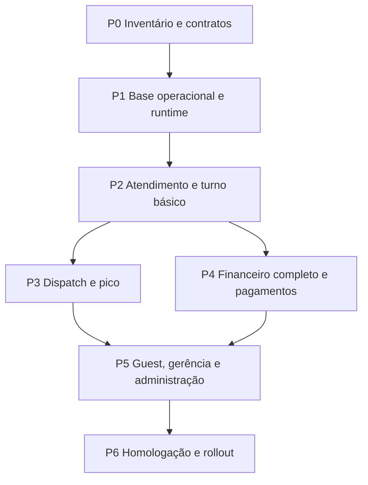

# Plano de implementação do produto completo

> Foco esclarecido pelo usuário: a próxima implementação solicitada é fidelidade visual. Ver [plano pixel-perfect](../design/pixel-perfect-implementation-plan.md). Este documento permanece contexto funcional, não o plano visual.

Data: 2026-10-08. Estado: **planejado; implementação das etapas abaixo não declarada**.
Contrato do programa: [Spec 022](../../specs/022-full-product-implementation/spec.md).
Referências visuais e diferenças intencionais: [KB dos protótipos](../design/prototype-integration.md).

## Resultado esperado

Entregar Rodada como PDV próprio utilizável durante um turno inteiro: configurar o estabelecimento, autenticar a equipe, abrir caixa e ocupações, localizar/criar comandas, pedir, produzir, coordenar entrega, cobrar parcialmente, corrigir exceções, fechar caixa e revisar a operação. Atendimento é Android nativo; Cozinha, Bar, Cliente e Gerência são Web/PWA. Todas as superfícies usam o mesmo domínio, disponibilidade, autorização, semântica visual e trilha financeira.

Os cinco exports definem hierarquia e situações operacionais. Não são implementação de backend, política financeira, SLA ou prova de operação offline. Não incorporar seu runtime DC em produção. Implementar cada interação sobre comandos e leituras canônicas, mantendo as diferenças documentadas na KB.

“Produto completo” cobre o escopo aceito das Specs 001–018 e superfícies 019–021. Fiscal, ERP, estoque profundo, delivery externo, loyalty e promoção automática de relacionamento ficam fora. IA de ícones continua adiada; fallback e identidade ProductIcon reutilizável são suficientes para lançamento. Planejar não autoriza ativar serviços pagos, publicar ou contratar hardware.

## Ponto de partida verificado

Esta matriz descreve código presente, não certificação de produção. Checkboxes antigos de specs não medem conclusão: há listas desatualizadas mesmo onde APIs e testes já existem.

| Capacidade | Evidência no repositório | O que falta para o produto |
| --- | --- | --- |
| Pedidos, comandas e ledger | `apps/api/modules/ordering`, `ledger`; testes de ordering/ledger | Completar jornadas nativas, contratos de leitura e concorrência entre canais |
| Conta da Casa | `house_account`; políticas, exposição, override e testes | UX integrada de bloqueio/aprovação, responsabilidade e histórico em todos os fluxos |
| Catálogo e disponibilidade | `catalog`; suggest, resolve-or-create, auditoria e jobs de ícone | Administração completa e propagação realtime; manter IA desativada |
| Cozinha/Bar | `apps/web/components/production-board.tsx`; Spec 021 | Agrupamento por identidade de preparo, variantes, prioridade configurável e coordenação do passe |
| Dispatch | `dispatch/models.py`, serviços e endpoints de entrega | Chamadas, ownership, runs, milestones/provenance e correção por exceção; conclusão manual atual não satisfaz o happy path passivo |
| Mesas e guest | `hospitality`, `guest_access`; testes de QR/ocupação | Jornada completa, mapa e recovery contextual; revogação consistente em caches |
| Transferência/divisão de contas | `tab_operations/services.py`; preview, versões e locks | Completar UX e matriz de conflitos com pagamentos, correções e mudança de destino |
| Caixa e correções | `cash`, `corrections`; testes e smoke de turno | Fechar casos operacionais restantes, comprovantes, treinamento e reconciliação integrada |
| Pagamentos integrados | `payment_provider/adapters.py`; port e double determinístico | Adaptador real, credenciais/provisionamento, SDK Android, webhooks e homologação. Double não é provider de produção |
| Atendimento Android | `apps/attendance-android`; auth, operações, tema, intenções locais e testes | Implementar paridade de jornada, estados de recovery, cobrança e integração de device |
| Gerência | `management/views.py`; calendário/relatórios; Web conectado | Projeções reprocessáveis, alertas com ciclo de vida e cockpit de exceções |
| Configuração/acesso | `venue`, `access`; sessões, capabilities e revogação | Onboarding operacional sem SQL e configuração dos módulos ainda incompletos |
| Conectividade | Polling e mecanismos locais existentes; Spec 014 | Outbox transacional, SSE, replay, shell PWA offline, caches seguros e conflitos ponta a ponta |
| Variantes/preço/comprovantes/covers/alertas | Specs 010/011/015/016/018 | Contratos e implementação completos; cancellation reversal existente não equivale a motor completo de descontos |
| Qualidade e recuperação | Workflows CI; smoke de turno; scripts de backup/restore | Ampliar PostgreSQL/concorrência, devices reais, falhas de rede e operações de produção |

A integração visual 021 registrou 110 testes Web e 20 JVM Android, build e lint. São evidências daquela entrega, não cobertura de todo este plano. A comparação completa da cozinha ainda tem diferenças documentadas; não declarar paridade total.

## Traduzir cada referência em produto

| Referência | Comportamento a entregar | Implementação/contrato | Evidência de aceite |
| --- | --- | --- | --- |
| Uma noite no bar | Agora, Contas, busca, comanda anônima, pedido, pagamento, limite e mudança de contexto | Android + APIs existentes; Specs 001/002/006/009/017 | Turno completo com duas comandas na mesma ocupação, parcial, override autorizado e correção |
| Sistema Rodada | Vocabulário único de linhas, ações, badges, field, combobox, dinheiro e tempo | Design system; componentes Compose/Web independentes com tokens semânticos compartilhados | Revisão de superfície adjacente, foco/toque, nomes longos, teclado, 360–430 px |
| Tela da Cozinha | Resumo → fila → passe; roteiro de preparo e disponibilidade | Ordering/catalog/dispatch; Specs 001/003/010/021 | Quantidades corretas por identidade de preparo; nenhuma mutation financeira por agrupamento visual |
| Modo pico | Atenção por exceção, ownership, destino e próxima ação | Specs 003/013/018; políticas por Venue | Pico determinístico sem taps obrigatórios de medição nem thresholds copiados do demo |
| Sem sinal → Sincronizado | Snapshot, draft, pendência honesta, retry e reconciliação | Spec 014 + ADR HTTP/SSE | Perda de resposta após commit, sessão revogada, item esgotado, preço alterado e pagamento ambíguo |

## Contratos que precisam existir antes de código novo

Atualizar a spec do domínio afetado antes de cada PR de comportamento. A Spec 022 organiza entrega; não substitui regras detalhadas dos módulos.

- Leituras operacionais: IDs estáveis, versões, timestamps canônicos, localização atual e snapshot histórico, capability da ação e contexto de freshness. Busca paginada por nome/código/contexto; evitar N+1 e associação por nome. Publicar schema de API e clients tipados, incluindo erros de negócio recuperáveis.
- Preparo: chave estruturada por Product/variante/modificadores relevantes/estação. Não usar nome como identidade para ações ou lotes; o resumo atual por nome é somente leitura. Definir observação livre versus modificador estruturado, snapshots de preço/routing e limites de agregação.
- Coordenação: catálogo de Task/service/bill, prioridade, ownership, DeliveryRun, estados e regras de destino quando Tab muda. Separar trabalho aberto de milestone inferido e de evento financeiro.
- Financeiro: revisar matriz split/merge/transfer com saldo, parcial, refund e pagamento pendente. Definir rateio determinístico em centavos, arredondamento, serviço, cortesia e reversões auditáveis; preservar registros originais.
- Políticas: timezone/cutoff, SLA por estação/tarefa, guest, exposição, approvals, alertas e configuração versionada. Valores demonstrativos dos exports não são defaults aprovados.
- Runtime: envelope de evento/cursor, retenção/replay, escopo de sessão/Venue, versionamento de payload e classes de intenção offline. Mudança durável de arquitetura exige ADR relacionado.

## Ordem de entrega e dependências

Cada pacote abaixo deve resultar em PRs pequenos com spec atualizada, migration quando aplicável, UI necessária, testes de aceite e evidência. Responsabilidade indica disciplina, não uma equipe ou prazo já contratado. Não estimar calendário sem capacidade de equipe e acesso ao provider; usar gates para ordenar o trabalho.

O adaptador de pagamento pode ser preparado após P0, em paralelo ao runtime, por depender de acesso externo. Contratos de variantes/preço devem estar definidos antes de P2; sua implementação completa entra em P4. O piloto controlado tem gate próprio em P2 e não equivale ao produto completo.

| Pacote / disciplina | Entrega concreta | Dependências | Gate para avançar |
| --- | --- | --- | --- |
| P0 — Produto/engenharia/design | Auditar specs contra código/testes; matriz de ações e conflitos; schema de API; fixtures de turno e inventário de componentes | Estado atual + referências | Cada lacuna tem spec, pacote, aceite e evidência esperada; nenhuma feature “pronta” apenas por checkbox |
| P1 — Backend/plataforma/clients | Outbox/SSE, snapshot/replay, typed clients, cache seguro, configuração e auth consistentes | P0; Specs 008/013/014 | Dois clients convergem após reconnect; comandos não duplicam; revogação elimina acesso/cache |
| P2 — Android/Web/domínio | Agora/Contas/Pedir, histórico, produção/passe, contas e ocupações, caixa/manual payment, recovery mínimo | P1; Specs 001/002/004/009/012/017 | Turno piloto completo sem SQL, sem confirmação offline falsa, sem venda indisponível |
| P3 — Dispatch/design | Chamadas, ownership, prioridade, runs, provenance, correções e modo pico | P2; Specs 003/018 | Operação sem sensor continua; milestone desconhecido não vira fato; happy path não exige taps de medição |
| P4 — Financeiro/payments/device | Variantes, pricing, split/correções completos; adaptador real, Tap/Pix suportados e comprovantes | P2 + contratos P0; Specs 006/009/010/011/015/017 | Concorrência PostgreSQL e reconciliação provider passam; nenhuma ambiguidade vira nova cobrança |
| P5 — Guest/gerência/admin | Guest completo, configuração, covers, cockpit/alertas, relatórios reprocessáveis, treinamento | P3/P4; Specs 004/007/013/016/018 | Noite inteira com staff/guest concorrentes, próxima ação legível e números reconciliados |
| P6 — Qualidade/operações | Homologação em devices, rede real, carga, segurança, restore, observabilidade e rollout | P5 | Todos os critérios de release aceitos com evidência; rollback ensaiado |

## Backlog inicial de PRs

Executar nesta ordem respeitando dependências. Não criar nova implementação de capacidades que já existem; estender os módulos atuais.

| ID | Mudança revisável | Depende de | Teste que encerra o PR |
| --- | --- | --- | --- |
| R01 | Auditar status/aceites 001–021 e registrar gaps por superfície; detalhar contratos faltantes | — | Matriz código→critério→teste; sem conclusão por existência de endpoint |
| R02 | Schema de comandos/leituras/erros; clients tipados; versões e snapshots necessários | R01 | Contract tests e acesso entre Venues negado |
| R03 | Outbox transacional nos comandos operacionais prioritários + dispatcher com retry | R02 | Rollback não publica; crash após commit publica ao reiniciar sem duplicar efeito |
| R04 | SSE autenticado, cursor/replay, snapshot em gap, revogação e proxy configurado | R03 | Queda/replay/múltiplos clients convergem e não vazam evento de outro Venue |
| R05 | Cache scoped e shell PWA; runtime Android; classificação e UI de intenções pendentes | R04 | Reabertura offline, logout/revogação, retry e conflito preservam verdade canônica |
| R06 | Agora/Contas Android, busca, criar/abrir Tab e contexto de destino/ocupação | R02/R05 | Comanda anônima sem mesa e duas Tabs na mesa, troca de operador segura |
| R07 | Pedir Android, autocomplete-first, carrinho, revisão, confirmar e produção adjacente | R06 | Corrida de disponibilidade/preço e resposta perdida geram um único pedido |
| R08 | Parcial/manual, Conta da Casa, preview de transferência e caixa na jornada nativa | R07 | Exposição/cash/ledger reconciliados; concorrência e aprovação negada preservam saldo |
| R09 | Service/bill tasks e ownership; idempotência, destino e SLA configurável | R04/R07 | Chamadas concorrentes e mudança de localização mantêm histórico e ação correta |
| R10 | Milestones com provenance, correção por exceção e migração do legado manual | R09 | Evento original preservado; nenhuma duração sozinha confirma entrega |
| R11 | DeliveryRun, sinais opcionais em shadow e política conservadora de resolução | R10 | Falha de sensor não bloqueia; calibração e falsos positivos medidos antes de habilitar resolução |
| R12 | Variantes/modificadores, chave de preparo e snapshots; atualizar todas as superfícies | R07 | Itens de mesmo nome com preparo distinto não são confundidos |
| R13 | Pricing/serviço/desconto/rateio + completar split/refund/correções | R08/R12 | Centavos exatos, autorização/auditoria e races PostgreSQL |
| R14 | Provider real e ciclo completo Android; webhooks, lookup, reconciliação e pendência | R02/R08/R13 + acesso ao provider | Sandbox/hardware: sucesso, recusa, timeout, duplicata, refund e perda de callback |
| R15 | Comprovantes digitais/printing com fallback e reimpressão auditável | R13/R14 | Falha de impressora não duplica venda/pagamento; documento identifica origem e reimpressão |
| R16 | Administração, guest end-to-end, covers desconhecidos e contexto/mapa | R09/R13/R14 | Revogar ocupação encerra sessão antiga; guest bloqueado não bloqueia staff |
| R17 | Projeções de gerência e alertas deduplicados, ack/resolução/escalada | R10/R13/R16 | Rebuild produz mesmo financeiro; inferência explicitada; ack não resolve causa |
| R18 | CI/carga/devices/restore/runbooks; piloto e rollout por Venue | R11/R15/R17 | Ensaio de turno, falhas e recuperação com evidência de todos os gates |

R12/R13 exigem contratos em R01/R02 antes de R07 para não perpetuar DTOs incompatíveis. PRs podem ser subdivididos por critério, especialmente R05/R14/R16; nenhum pacote grande deve virar um único merge sem revisão incremental.

## Runtime e operação degradada

Usar [ADR HTTP/SSE/outbox](../adr/0009-http-commands-sse-realtime-outbox.md). PostgreSQL confirma comandos HTTP; event delivery apenas atualiza leituras. Gravar outbox na mesma transação do fato. Worker suporta lease/retry, entrega pelo menos uma vez, monitoramento de atraso e eventos falhos; consumers idempotentes. Redis só entra se necessário para fanout, sem substituir persistência. Não começar por WebSocket ou microserviços.

SSE precisa de autorização por Venue/sessão, heartbeat, proxy sem buffering, cursor, retenção e replay. Cursor expirado solicita snapshot; aplicar snapshot e deltas sem perder alterações no intervalo. Medir atraso entre commit e projeção. Revogação deve interromper stream e impedir replay posterior. Migration de payload exige compatibilidade entre versões de app durante rollout.

Separar saúde da API de saúde realtime: ONLINE, RECONNECTING, STALE e OFFLINE não podem mascarar HTTP ainda funcional. Web usa shell cacheável e IndexedDB; Android usa armazenamento local protegido apropriado. Namespace de cache por Venue/operador/ocupação, expiração e limpeza em troca de conta/logout/revogação. PWA deve abrir sem depender de SSR remoto. Não armazenar credenciais financeiras nem prolongar sessão guest expirada.

| Classe | Regra de implementação |
| --- | --- |
| A: confirmação de pedido, financeiro, acesso e mutations críticas | API obrigatória; nunca apresentar como confirmado offline |
| B: drafts/intenção permitida | UUID/idempotency key estável, pendente explícito; revalidar sessão, preço, disponibilidade e versão ao reenviar |
| C: progresso operacional previamente confirmado | Somente comandos expressamente permitidos pela Spec 014 e testes de conflito; desabilitado até passar o gate, com leitura/runbook como fallback |
| D: estado local de UI | Filtros/drafts sem efeito canônico; sincronização não inventa comando |

Resposta perdida após commit usa lookup/retry da mesma intenção. Pagamento ambíguo fica CONFIRMATION_PENDING até consulta/reconciliação; não lançar outra cobrança equivalente. Recebimento externo emergencial exige evidência e revisão prevista em spec, sem criar Payment confirmado automaticamente.

## Dispatch sem trabalho artificial

Estender o dispatch atual, preservando tarefas e conclusões manuais como fatos legados. Não reclassificar eventos antigos como inferidos. Criar milestones com occurred_at, recorded_at, source, confidence, evidence/provenance e versão de inferência; ligar correções ao evento original. Separar destino atual de snapshot observado no momento da tarefa/run.

Retirada/entrega podem permanecer desconhecidas quando não há evidência. Não finalizar entrega apenas porque o timer passou. Sinais de passe, presença, percurso e confirmação natural guest são opcionais e sujeitos à política aprovada. Começar em shadow, medir falso positivo e revisar exceções antes de habilitar resolução automática por Venue. Manual continua disponível para exceção e confirmação deliberada; nenhum tap é requisito para produzir métricas no happy path. BLE indisponível não bloqueia pedido, produção ou atendimento.

## Financeiro e integração de device

Reutilizar ledger, provider port, cash e locks existentes. Testar saldo/exposição, responsabilidade entre contas, limites e rateios com PostgreSQL real; SQLite não comprova bloqueios de linha. Todo valor em centavos, transação em alteração de saldo, idempotência para evento externo, trilha com ator/horário/antes/depois/motivo quando aplicável. Refund não apaga pagamento original; transferências não reparentam silenciosamente histórico.

O adapter determinístico e a classe Android de disponibilidade são scaffolding testável. R14 exige artefato/SDK real, elegibilidade do aparelho, credenciais, ativação comercial e ambiente de homologação. Estender o port com iniciar/consultar/cancelar quando suportado e definir estados reconciliáveis server-side. Validar webhook autenticado, duplicado, fora de ordem e callback perdido; a UI não decide liquidação. Pix e Tap seguem capacidades reais do provider, sem hardcode no domínio. Não prometer suporte a hardware não homologado.

## Design system e implementação das jornadas

Promover padrões dos exports para componentes semânticos em [design system](../design/system.md) antes de replicá-los. Web e Compose compartilham contratos/tokens, não precisam compartilhar runtime. CatalogCombobox/ProductIcon, linha de Tab, dinheiro, StatusBadge, age, chamada e pending intent devem ter estados documentados: loading, vazio, desconhecido, stale, bloqueado, pending, sucesso e erro recuperável.

No Android, entregar navegação Agora/Contas/Pedir, busca contextual, resumo da comanda, pedido/revisão, cobrança/aprovação, destino e exceções. No Web, completar produção/passe, guest, mesas e Gerência mantendo vocabulário adjacente. Pico altera hierarquia e próxima ação conforme política; não cria app separado. Mapa é ferramenta de localização, não identidade financeira nem tela inicial obrigatória.

Fixtures determinísticas devem cobrir nomes longos, muitos itens, zero/alta exposição, modifier, múltiplas Tabs, idade desconhecida, fila atrasada e reconnect. Comparar referência executável quando existir; justificar diferenças de domínio/responsividade e corrigir regressões. Rodar `cd apps/web && npm run test:visual` em toda mudança Web/PWA de UI; não substituir baseline para esconder diferença. Incluir screenshots Compose em emulador/device e toque/foco/leitor de tela.

## Gerência, configuração e informação honesta

Completar onboarding de Venue, equipe/capabilities, estações, mesas/zonas/pontos, catálogo, políticas e calendário sem editar banco manualmente. Configuração deve validar efeitos e ser auditável/versionada. NFC/código curto/perfil resolvem a mesma Tab; não exigir CPF, conta guest ou UID NFC como prova forte.

Evoluir relatórios atuais para projeções reprocessáveis onde o volume exigir, com freshness e reconciliação. Cockpit prioriza exceções e próxima ação durante serviço. Alertas têm deduplicação, ownership, reconhecimento, resolução da causa e escalada; reconhecimento não equivale a resolução. Cortes seguem business date/timezone do Venue, inclusive DST. Covers desconhecidos não viram zero. Indicadores diferenciam fato, estimativa e hipótese; não criar leaderboard de funcionários com inferência como precisão individual.

## Validação e gates de release

| Gate | Critérios e evidências obrigatórios |
| --- | --- |
| G0 — Contratos | R01/R02 completos; aceite por spec e por superfície; decisões abertas atribuídas antes da implementação dependente |
| G1 — Runtime | Commit/replay/reconnect/revogação/gap passam; pending não aparece confirmado; health de API e stream independentes |
| G2 — Piloto controlado | Turno básico P2 em staging/devices: caixa→pedido→produção→coordenação→parcial→fechamento; staff/guest concorrentes; rollback e recovery ensaiados |
| G3 — Produto completo | P3–P5, provider/hardware homologados, comprovantes e todos os critérios aplicáveis 001–018 demonstrados; sem passos manuais ocultos para setup/recuperação |
| G4 — Produção | Carga, segurança, backup/restore, alertas, migração compatível, treinamento, suporte e rollout aprovados com evidência |

G2 permite piloto explicitamente reduzido com recebimento manual legítimo e sem geração IA ou sensores. Deve declarar limites de conectividade e features desabilitadas. Não chamar esse piloto de pagamento integrado completo ou operação offline plena. G3 exige provider real e runtime completo; não contornar dependência externa com um double.

Ampliar CI: testes de domínio/contrato, migrations, PostgreSQL para todo financeiro e concorrência, smoke multicanal com API real, Web typecheck/build/visual, Android unit/build/lint e instrumentação. Path filters devem considerar tokens, referências, schemas e mudanças compartilhadas. Exercitar retries simultâneos, último item disponível, split durante pagamento, refund duplicado, revogação em reconnect, liberação de mesa com guest antigo e crash de worker. Não usar apenas mocks para comprovar essas garantias.

Orçamentos iniciais propostos, a confirmar em device/rede do piloto: interação local p95 ≤100 ms, abertura de snapshot cacheado ≤1 s e commit→superfície conectada p95 ≤2 s sob carga alvo. Registrar workload, hardware e percentis; esses números não são desempenho já medido nem SLA comercial. R01 define volume real de Tabs/itens/clients e R18 valida saturação, memória, bateria e filas. Nenhum orçamento permite ignorar consistência financeira.

## Preparação de produção e rollout

Preparar staging com PostgreSQL, workers, storage, TLS/hosts canônicos, secrets separados, migrações e healthchecks; configurar streaming no proxy. Registrar versões, command IDs/correlation IDs sem expor dados sensíveis, atraso/outbox, falhas de jobs, reconciliação pendente, freshness e erros de auth. Backups existentes precisam execução agendada, monitoração e restore ensaiado em banco isolado; verificar ledger, caixa, ocupações e tarefas após restore.

Flags tipadas por Venue controlam capacidades novas e inferência. Dependências inválidas devem ser rejeitadas; configuração é auditada. Rollout: equipe interna → shadow de inferência → piloto reduzido → piloto completo → expansão. Cada estágio exige critérios e evidência; não avança por tempo decorrido. Rollback desabilita capacidade preservando comandos já aceitos, eventos e reconciliação; migrations compatíveis e rebuild de projeção são preferíveis a apagar dados. Não interromper tratamento de pagamentos pendentes ao desligar UI nova.

Runbooks precisam cobrir rede fora, device perdido, sessão revogada, fila parada, provider pendente, impressora indisponível, divergência de caixa, restore e suporte durante turno. Treinar operação com leitura stale e confirmação pendente antes do piloto.

## Decisões e dependências externas

| Item | Resolver até | Responsável / saída verificável |
| --- | --- | --- |
| Carga, fluxo e hardware do Bar do Aderlan | R01 | Produto/operações: cenário de turno e dispositivos de teste |
| Políticas de limite, SLA, prioridade e guest | R01, antes de cada domínio | Produto + domínio: spec, configuração validada e fixtures; sem copiar números do demo |
| SDK/provider, elegibilidade, credenciais e ativação | Antes do aceite R14 | Integrações/operações: sandbox e aparelhos homologáveis; separar implementação de autorização para ativação |
| Impressoras e documento necessário | Antes R15 | Operações: modelo/protocolo e fallback; recibo não promete validade fiscal |
| Sinais/calibração de inferência | Antes de habilitar R11 | Produto/dispatch: evidência, política e limite de falso positivo; sensor opcional |
| Hosting, backup, suporte e critérios de rollout | Antes G4 | Plataforma/operações: runbooks e ensaios registrados |

Bloqueio externo de pagamento não impede contratos, runtime ou piloto manual declarado, mas impede declarar G3 concluído. Não há data de lançamento responsável até dimensionar equipe, provider e hardware.

## Rastreabilidade e manutenção da KB

| Specs | Pacotes que completam o contrato |
| --- | --- |
| 001 Core POS; 002 Conta da Casa | P2/P4 |
| 003 Dispatch | P3 |
| 004 Table/Guest | P2/P5 |
| 005 Catalog/ícones | P2/P5; geração IA continua adiada |
| 006 Payments | P4 |
| 007 Management | P5 |
| 008 Access | P1/P2/P5 |
| 009 Tab operations | P2/P4 |
| 010 Modifiers; 011 Pricing | P4, contratos P0 |
| 012 Cash | P2/P4 |
| 013 Configuration | P1/P5 |
| 014 Connectivity | P1/P2/P6 |
| 015 Receipts | P4 |
| 016 Covers | P5 |
| 017 Corrections | P2/P4 |
| 018 Notifications | P3/P5 |
| 019 Routing; 020 Web completion; 021 Reference integration | Preservar regressões em P1–P6 |

Após cada PR: atualizar spec/plan/tasks/acceptance do domínio, registrar evidência datada e limitações, atualizar KB quando mudar tradução do protótipo e ADR quando mudar decisão durável. “Implementado”, “validado em staging” e “liberado em produção” são estados distintos. O checklist da Spec 022 acompanha gates; não encerra critérios de outras specs automaticamente.
